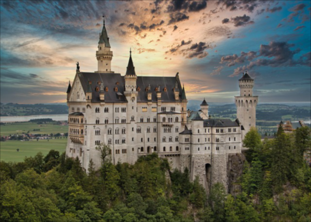
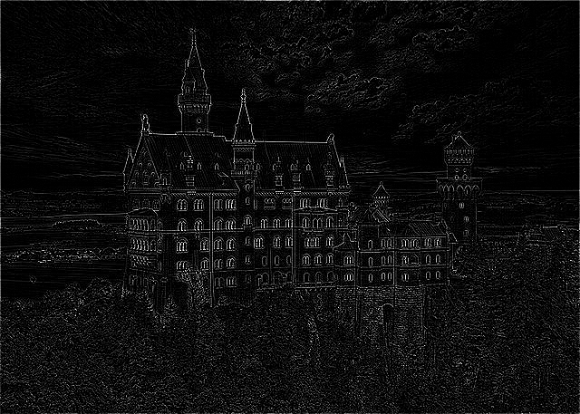
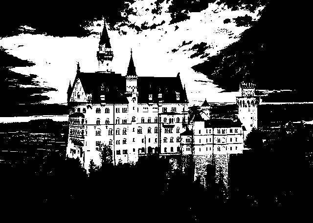
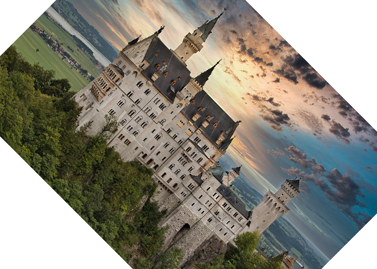
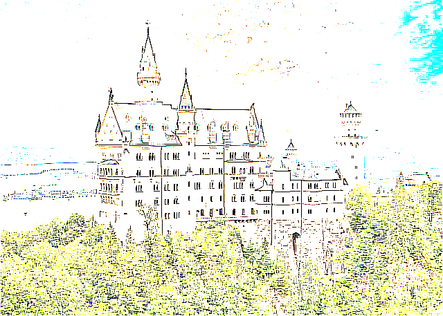
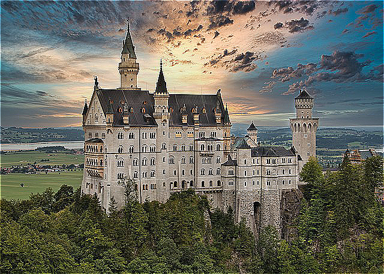

# GO-IMG-KERNEL
**GO-IMG-KERNEL** is a Go library for image processing, 
leveraging convolutional operations to perform various transformations such as blurring, 
edge detection, binarization, and more. 

This library aims to provide simple-to-use functions for handling images,
whether in RGB or grayscale formats.

## Features

- Image loading and saving in various formats (JPEG, PNG).
- Support for RGB and grayscale images.
- Common image transformations:
  - Gaussian blur
  - Edge detection
  - Binarization
  - Image rotation and reflection
  - Horizontal transformation
  - Sharpening

## Usage
    
```go
rgbImage, err := utils.LoadRGBImage(
    "../examples/input/castle_rgb.jpg",
) // Load RGB image
if err != nil {
    panic(err)
}
newImage := transformation.BoxBlurRGB(rgbImage, 0, 3) // Apply box blur (0 - padding, 3 -stride)
err = utils.SaveImage(
    newImage,
    "../examples/output/blurred.jpg",
    false,
) // Save image
if err != nil {
    panic(err)
}
```

## Examples

| Transformation            |                                                                              Kernel Matrix                                                                               | Input Image                                             |                         Output Image                          |
|:--------------------------|:------------------------------------------------------------------------------------------------------------------------------------------------------------------------:|:-------------------------------------------------------:|:-------------------------------------------------------------:|
| Box Blur                  |     $`\begin{bmatrix} \frac{1}{9} & \frac{1}{9} & \frac{1}{9} \\ \frac{1}{9} & \frac{1}{9} & \frac{1}{9} \\ \frac{1}{9} & \frac{1}{9} & \frac{1}{9} \end{bmatrix}`$      |          |                    |
| Gaussian Blur             | $`\begin{bmatrix} \frac{1}{16} & \frac{2}{16} & \frac{1}{16} \\ \frac{2}{16} & \frac{4}{16} & \frac{2}{16} \\ \frac{1}{16} & \frac{2}{16} & \frac{1}{16} \end{bmatrix}`$ |  |  |
| Edge Detection            |                                                $`\begin{bmatrix} 0 & -1 & 0 \\ -1 & 4 & -1 \\ 0 & -1 & 0 \end{bmatrix}`$                                                 |          |                 |
| Diagonal Edge Detection   |                                                 $`\begin{bmatrix} 1 & 0 & -1 \\ 0 & 0 & 0 \\ -1 & 0 & 1 \end{bmatrix}`$                                                  |          |                 |
| Binarization              |                                                $`\begin{bmatrix} 0 & -1 & 0 \\ -1 & 4 & -1 \\ 0 & -1 & 0 \end{bmatrix}`$                                                 |          |                   |
| Image Rotation (45°)      |                                                                                  $$-$$                                                                                   |  |                   |
| Image Reflection          |                                                  $`\begin{bmatrix} -1 & 0 & 0 \\ 0 & 1 & 0 \\ 0 & 0 & 1 \end{bmatrix}`$                                                  |          |               |
| Horizontal Transformation |                                            $`\begin{bmatrix} -10 & 10 & -10 \\ 10 & 10 & 10 \\ -10 & 10 & -10 \end{bmatrix}`$                                            |          |  |
| Ridge Detection           |                                              $`\begin{bmatrix} -1 & -1 & -1 \\ -1 & 8 & -1 \\ -1 & -1 & -1 \end{bmatrix}`$                                               |          |                        |
| Sharpening                |                                                $`\begin{bmatrix} 0 & -1 & 0 \\ -1 & 5 & -1 \\ 0 & -1 & 0 \end{bmatrix}`$                                                 |          |                |

## Testing

```bash
go test -v ./test
```
